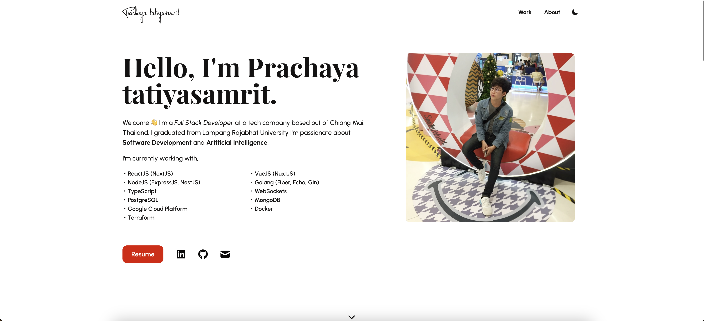

# Portfolio Template 🖐



---

## Table of Contents

- [Installation](#installation)
- [Usage](#usage)
- [Contributing](#contributing)
- [Connect](#connect)
- [License](#license)

---

## Installation

### Setup 

Close repository

```shell
$ git clone https://github.com/sprite5641/portfolio.git
```

To install the node packages used in the project:

```shell
$ cd portfolio
$ yarn install
```

Compiles and hot-reloads for development

```shell
$ yarn start
```

Compiles and minifies for production
```shell
$ yarn build
```

## Usage

All the information can be edited in the JSONs and Markdowns in the [content folder](https://github.com/sprite5641/portfolio/tree/main/src/content). Each section of the portfolio has its own folder. The `common.json` file contains details that are used throughout the website. 

All the images are in `public/assets`.

## Contributing 

- Clone this repo to your local machine.
- Checkout to a new branch. Give it a relevant name!
- Create a pull request

## Connect

- Website at <a href="https://sprite5641.github.io/" target="_blank">`https://sprite5641.github.io/`</a>
- LinkedIn at <a href="https://www.linkedin.com/in/prachaya-tatiyasamrit-6689941b0/" target="_blank">`sprite5641`</a>

## License

[](https://github.com/sprite5641/portfolio/blob/master/LICENSE) 

- **[MIT license](http://opensource.org/licenses/mit-license.php)**
- Copyright 2022 © <a href="https://sprite5641.github.io/" target="_blank">Prachaya tatiyasamrit</a>